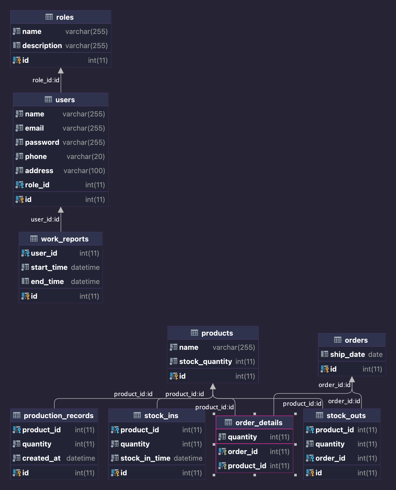

這題是要設計一個資料庫。
因為題目描述不完整，所以有些地方我用假設的。

## ER model


## 員工資訊及權限

一開始看到「員工帳號資訊」和「系統使用模組權限」，直覺想到建兩張表來存：

```SQL
-- 建立權限資訊表格
Create TABLE roles
(
    id          INT          NOT NULL PRIMARY KEY,
    name        VARCHAR(255) NOT NULL,
    description varchar(255)
);
```

```SQL
-- 建立員工資訊表格
CREATE TABLE users
(
    id       INT          NOT NULL PRIMARY KEY,
    name     VARCHAR(255) NOT NULL,
    email    VARCHAR(255) NOT NULL,
    password VARCHAR(255) NOT NULL,
    phone    varchar(20)  NOT NULL,
    address  varchar(100) NOT NULL,
    role_id  INT          NOT NULL,
    FOREIGN KEY (role_id) REFERENCES roles (id)
);
```

舉例而言，roles 表格可能會像以下這樣：
| id | name | description |
| :--- | :--- | :--- |
| 1 | boss | 老闆，有全部權限 |
| 2 | employees | 一般員工 |
| 3 | supervisor | 主管 |

所以在 user 表中的 role_id 只需要填入數字即可。

## 產品管理
表格上是說要有產品編號和名稱。
但下面還有一個庫存報表，要顯示庫存總覽，我不太確定這邊所謂的庫存是指「產品庫存」抑或是「物料庫存」，就假設是產品庫存。
因此，我會把庫存也放在產品資料的 table，SQL Script 如下：

```SQL
-- 建立產品資訊表格
CREATE TABLE products
(
    id             INT          NOT NULL PRIMARY KEY,
    name           VARCHAR(255) NOT NULL,
    stock_quantity INT          NOT NULL
);
```

## 生產報工
另開一個表來存，用一個 Foreign Key 連到 user。

```SQL
-- 建立報工資料表
CREATE TABLE work_reports
(
    id         INT      NOT NULL PRIMARY KEY AUTO_INCREMENT,
    user_id    INT      NOT NULL,
    start_time DATETIME NOT NULL,
    end_time   DATETIME,
    FOREIGN KEY (user_id) REFERENCES users (id)
);
```

## 訂單管理

訂單管理我自己會分成兩張表，因為一張訂單可能包含多種產品。
第一張「訂單資訊表格」存訂單 id 和發貨日期。

```SQL
-- 建立訂單資訊表格
CREATE TABLE orders
(
    id        INT  NOT NULL PRIMARY KEY AUTO_INCREMENT,
    ship_date DATE,
);
```

第二張表是「訂單明細表格」，存各產品被訂了多少數量。
-- 建立訂單明細表格
```SQL
-- 建立訂單明細表格
CREATE TABLE order_details
(
    order_id   INT NOT NULL,
    product_id INT NOT NULL,
    quantity   INT NOT NULL,
    PRIMARY KEY (order_id, product_id),
    FOREIGN KEY (order_id) REFERENCES orders (id),
    FOREIGN KEY (product_id) REFERENCES products (id)
);
```

所以如果有以下兩個產品：
| id | name | stock\_quantity |
| :--- | :--- | :--- |
| 1 | 牛奶 | 5 |
| 2 | 蛋 | 6 |

假設 A 買了兩顆蛋，B 買了四瓶牛奶和三顆蛋。
A 買的已經出貨，B 的還沒：

訂單資訊如下：
| id | ship\_date |
| :--- | :--- |
| 1 | 2023-03-02 |
| 2 |  |

訂單明細如下：
| order\_id | product\_id | quantity |
| :--- | :--- | :--- |
| 1 | 2 | 2 |
| 2 | 1 | 4 |
| 2 | 2 | 3 |

## 出入庫
### 入庫
入庫的資料表設計如下：
```SQL
-- 建立入庫記錄表格
CREATE TABLE stock_ins
(
    id         INT NOT NULL PRIMARY KEY,
    product_id INT NOT NULL,
    quantity   INT NOT NULL,
    stock_in_time DATETIME NOT NULL,
    FOREIGN KEY (product_id) REFERENCES products (id)
);
```
會紀錄是哪個產品、數量和入庫的時間。

### 出庫
不確定什麼情況會出庫，如果有很多種情況（例如出貨、報廢）的話，就要建另一張表來存狀況。
但這邊假設出庫只有「出貨」一種狀況：
```SQL
-- 建立出庫記錄表格
CREATE TABLE stock_outs
(
    id         INT NOT NULL PRIMARY KEY,
    product_id INT NOT NULL,
    quantity   INT NOT NULL,
    order_id   INT NOT NULL,
    FOREIGN KEY (product_id) REFERENCES products (id),
    FOREIGN KEY (order_id) REFERENCES orders (id)
);
```
會紀錄現在出的是哪一個產品、數量，然後是因為哪張訂單出貨的。

## 生產紀錄表

就紀錄產了多少、什麼時候產。

```SQL
-- 建立產出數量紀錄表格
CREATE TABLE production_records
(
    id         INT      NOT NULL PRIMARY KEY,
    product_id INT      NOT NULL,
    quantity   INT      NOT NULL,
    created_at DATETIME NOT NULL DEFAULT CURRENT_TIMESTAMP,
    FOREIGN KEY (product_id) REFERENCES products (id)
);

```
